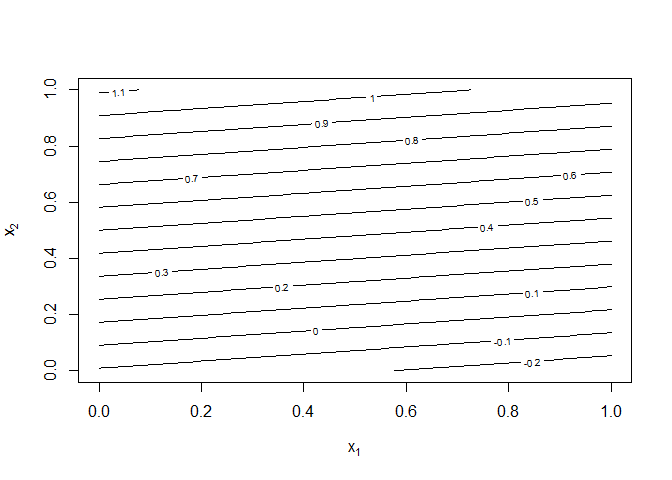
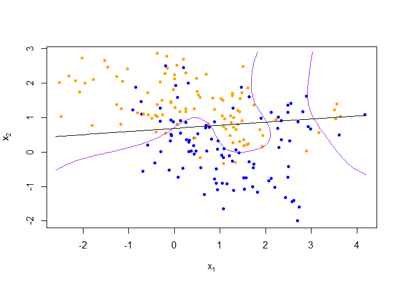
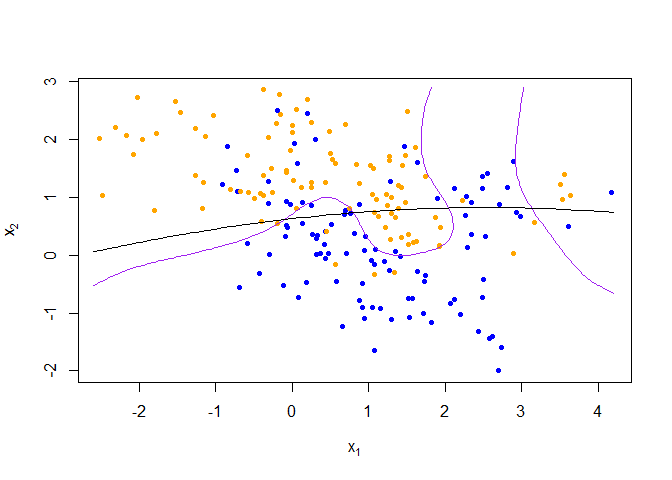

Homework - I
================
Sriram Kannan

``` r
library('class')
library('dplyr')
```

    ## 
    ## Attaching package: 'dplyr'

    ## The following objects are masked from 'package:stats':
    ## 
    ##     filter, lag

    ## The following objects are masked from 'package:base':
    ## 
    ##     intersect, setdiff, setequal, union

``` r
load(url('https://web.stanford.edu/~hastie/ElemStatLearn/datasets/ESL.mixture.rda'))
dat <- ESL.mixture
```

``` r
plot_mix_data <- expression({
  plot(dat$x[,1], dat$x[,2],
       col=ifelse(dat$y==0, 'blue', 'orange'),
       pch=20,
       xlab=expression(x[1]),
       ylab=expression(x[2]))
  ## draw Bayes (True) classification boundary
  prob <- matrix(dat$prob, length(dat$px1), length(dat$px2))
  cont <- contourLines(dat$px1, dat$px2, prob, levels=0.5)
  rslt <- sapply(cont, lines, col='purple')
})

eval(plot_mix_data)
```

<!-- -->

1.  Re-write the functions fit\_lc and predict\_lc using lm, and the
    associated predict method for lm objects.

``` r
#lm classifier
data <- data.frame(y = dat$y, x1 = dat$x[,1], x2 = dat$x[,2])
data
```

    ##     y           x1           x2
    ## 1   0  2.526092968  0.321050446
    ## 2   0  0.366954472  0.031462099
    ## 3   0  0.768219076  0.717486166
    ## 4   0  0.693435680  0.777194034
    ## 5   0 -0.019836616  0.867253738
    ## 6   0  2.196544935 -1.023014058
    ## 7   0 -0.109159157 -0.530621080
    ## 8   0 -0.912620059  1.216216381
    ## 9   0  2.499842651 -0.418277898
    ## 10  0  1.897709107  0.973755498
    ## 11  0 -0.295362353  0.009673168
    ## 12  0 -0.681595736 -0.551650278
    ## 13  0  2.490978713  1.148315275
    ## 14  0 -0.053430597  0.484102460
    ## 15  0  0.687617592  0.705004818
    ## 16  0  1.279559523 -0.271033290
    ## 17  0 -0.313007477  1.273747315
    ## 18  0  2.813038608  1.167759713
    ## 19  0  0.319988146  0.017201649
    ## 20  0  0.437542376  0.413648012
    ## 21  0  2.432939360 -1.314363134
    ## 22  0 -0.429649585 -0.309811219
    ## 23  0  0.248728401  0.855519879
    ## 24  0  2.693936802 -1.999853402
    ## 25  0  1.467109246  1.877590719
    ## 26  0  1.040697342 -0.085187569
    ## 27  0  0.033318463  1.930257493
    ## 28  0  1.725681429 -0.455959142
    ## 29  0  1.149480708 -0.919790286
    ## 30  0  2.126868516  1.154179996
    ## 31  0  2.988126490  0.672350664
    ## 32  0  1.071866057 -1.643018423
    ## 33  0  1.084827301  0.102975324
    ## 34  0  0.267442252  0.362826378
    ## 35  0  1.282878941  1.276901247
    ## 36  0  0.129985619  0.544177695
    ## 37  0  2.489806031  1.358509888
    ## 38  0  0.818429991  0.379000419
    ## 39  0  1.532257922 -1.082164290
    ## 40  0  0.708542916  0.022464061
    ## 41  0  1.520914290 -0.742851486
    ## 42  0  0.887558794  0.883552173
    ## 43  0  1.576976508 -0.744933603
    ## 44  0  2.342765510  0.358477769
    ## 45  0 -0.191272364  2.493685703
    ## 46  0  1.749188014 -0.357915928
    ## 47  0 -0.840369051  1.881741308
    ## 48  0  0.946183859  0.073293605
    ## 49  0  0.915277236 -0.901759351
    ## 50  0  1.348700546  0.070452553
    ## 51  0  2.929863726  0.738892516
    ## 52  0  0.323206613  0.287959243
    ## 53  0  2.071415038 -0.830414760
    ## 54  0 -0.302274664  0.886232609
    ## 55  0  0.192282525 -0.479446546
    ## 56  0 -0.727077155  1.457361044
    ## 57  0  0.134347469  0.901675787
    ## 58  0 -0.077114461  0.505121685
    ## 59  0  2.710763558  0.876644795
    ## 60  0  4.170746208  1.079833767
    ## 61  0  0.325768984  0.347995798
    ## 62  0  0.205190129  2.453887785
    ## 63  0  1.640157488  1.608536949
    ## 64  0 -0.079583353  0.323311979
    ## 65  0  2.742092422 -1.600352769
    ## 66  0  0.310785039  2.007981737
    ## 67  0  2.290042376  0.137389748
    ## 68  0  0.659906227 -1.241636702
    ## 69  0  0.516429077  0.525151558
    ## 70  0  2.482942028 -0.737176464
    ## 71  0  1.053188784 -0.903565594
    ## 72  0  1.715233331 -1.014726822
    ## 73  0  1.210624499 -0.109150387
    ## 74  0  1.072035946 -0.165204649
    ## 75  0  0.878706588 -0.787134923
    ## 76  0  0.951265099 -1.095889767
    ## 77  0  0.425475683  0.184898617
    ## 78  0  2.125104790 -0.761847144
    ## 79  0  0.087614787 -0.733347412
    ## 80  0  2.285264980  1.008993039
    ## 81  0  0.470808790  0.025438551
    ## 82  0  3.611574669  0.490536018
    ## 83  0  2.576843426 -1.435682132
    ## 84  0  1.816825183 -1.161742789
    ## 85  0  2.892025340  1.625783044
    ## 86  0  0.916822986 -0.481920759
    ## 87  0 -0.074079101  0.919702238
    ## 88  0  0.574290652 -0.454657409
    ## 89  0 -0.589045843  0.207323551
    ## 90  0  2.624577968 -1.406259450
    ## 91  0  0.066332192  1.580805445
    ## 92  0  1.642844649 -0.283878559
    ## 93  0  2.551446154  1.418180412
    ## 94  0  1.419537021 -0.029746130
    ## 95  0 -0.715283835  1.107883553
    ## 96  0  0.434501300 -0.064545302
    ## 97  0  2.343730594  0.910978474
    ## 98  0  2.262714148  0.693601574
    ## 99  0  0.953833479  0.326034294
    ## 100 0  1.297167310 -1.113541170
    ## 101 1  1.870899745  0.654564443
    ## 102 1  3.637863023  1.039167443
    ## 103 1  3.529264199  0.959990564
    ## 104 1 -0.200683161  2.281585046
    ## 105 1  1.076956974 -0.330735232
    ## 106 1 -0.400761723  0.585843888
    ## 107 1 -0.368775793  1.038922700
    ## 108 1  1.613212710  1.860080951
    ## 109 1  1.301202425  0.725799603
    ## 110 1  1.238769995  1.052235708
    ## 111 1  1.486004801  1.714859663
    ## 112 1  1.098734773  0.961948009
    ## 113 1  0.692220033  2.255267507
    ## 114 1  1.079757235  0.742267953
    ## 115 1 -2.073318733  1.735423774
    ## 116 1 -2.017570738  2.720376775
    ## 117 1  1.351103591  0.649705578
    ## 118 1  0.528698093  1.647575574
    ## 119 1  1.741742104  1.357381623
    ## 120 1  0.752532941  0.809050152
    ## 121 1 -0.152822409  2.433115748
    ## 122 1 -1.264860817  1.384068805
    ## 123 1  1.334410988 -0.294440957
    ## 124 1  1.224054162  0.470747125
    ## 125 1 -1.464690853  2.473922169
    ## 126 1  1.623801765  0.240936940
    ## 127 1 -2.169201473  2.075904398
    ## 128 1  0.488746502  2.142041681
    ## 129 1 -1.136539074  2.052686203
    ## 130 1 -2.303862762  2.207488935
    ## 131 1 -0.019593015  1.805299380
    ## 132 1 -1.529105572  2.664528311
    ## 133 1 -0.071295170  1.460543433
    ## 134 1  0.880230865  1.242869428
    ## 135 1  0.013973130  1.283185943
    ## 136 1  0.433582885  1.261365481
    ## 137 1  1.269316909  1.633062578
    ## 138 1  1.432136010  0.306475077
    ## 139 1 -0.167523862  2.775192471
    ## 140 1 -0.071974368  1.427912819
    ## 141 1 -0.311647982  2.041098516
    ## 142 1  2.228716379  0.936223312
    ## 143 1 -1.776926087  2.108804862
    ## 144 1  1.047457586  1.039996187
    ## 145 1 -0.804293855  1.135668449
    ## 146 1  1.058348565  1.489829603
    ## 147 1  0.061145537  0.801422708
    ## 148 1  0.125021393  1.165593851
    ## 149 1 -2.477417617  1.026506205
    ## 150 1  1.442442554  1.545476693
    ## 151 1  1.028464289  1.550985579
    ## 152 1 -0.582356684  1.718885398
    ## 153 1 -1.960779713  2.002274242
    ## 154 1  2.887947028  0.020693004
    ## 155 1  1.391351682  0.813721723
    ## 156 1 -1.796286610  0.771731486
    ## 157 1  3.166971551  0.556946627
    ## 158 1 -0.487292651  0.979110495
    ## 159 1  0.508118067  1.757231990
    ## 160 1  1.591324822  0.215211634
    ## 161 1  1.385771564  1.201221704
    ## 162 1  0.566817311 -0.166103051
    ## 163 1 -0.370309590  2.855804967
    ## 164 1  1.926571814  0.150864353
    ## 165 1 -0.570429501  1.090314031
    ## 166 1  3.503126460  1.223981852
    ## 167 1  1.510827689  2.477865286
    ## 168 1 -0.369493348  1.384600180
    ## 169 1  1.522310375  0.186156137
    ## 170 1  0.056184431  2.519258089
    ## 171 1  0.571872338  1.577942178
    ## 172 1  0.005244683  2.125607235
    ## 173 1  1.126644806  0.665912397
    ## 174 1  1.945429440  0.481080499
    ## 175 1  1.244438442  0.852322687
    ## 176 1 -0.414441664  1.058147178
    ## 177 1 -0.257136280  1.085183909
    ## 178 1  1.287421847  0.272584762
    ## 179 1  1.436278077  1.174771281
    ## 180 1 -1.256441709  2.181549767
    ## 181 1  1.270289602  1.704139810
    ## 182 1  0.258880758  1.170055270
    ## 183 1  1.518293955  0.361734172
    ## 184 1  0.840697451  1.565475021
    ## 185 1 -0.264756676  1.491832426
    ## 186 1 -0.668445480  1.103914441
    ## 187 1  1.486247706  0.918180475
    ## 188 1  0.259433566  1.250357925
    ## 189 1  3.560612983  1.398988842
    ## 190 1 -1.162763070  1.250970789
    ## 191 1 -1.021784128  2.421916511
    ## 192 1 -1.169258605  0.812967619
    ## 193 1  0.205456121  2.688557551
    ## 194 1 -2.520819677  2.015033249
    ## 195 1  0.455341779  0.404037972
    ## 196 1  0.256750222  2.293604575
    ## 197 1  1.925173384  0.165052639
    ## 198 1  1.301941035  0.992199616
    ## 199 1  0.008130556  2.242263910
    ## 200 1 -0.196246334  0.551403559

``` r
fit_lm <- lm(y ~ x1+x2, data = data)
summary(fit_lm)
```

    ## 
    ## Call:
    ## lm(formula = y ~ x1 + x2, data = data)
    ## 
    ## Residuals:
    ##     Min      1Q  Median      3Q     Max 
    ## -0.9558 -0.3655  0.0318  0.3737  0.7779 
    ## 
    ## Coefficients:
    ##             Estimate Std. Error t value Pr(>|t|)    
    ## (Intercept)  0.32906    0.04783   6.880 7.77e-11 ***
    ## x1          -0.02264    0.02543  -0.890    0.374    
    ## x2           0.24960    0.03215   7.764 4.38e-13 ***
    ## ---
    ## Signif. codes:  0 '***' 0.001 '**' 0.01 '*' 0.05 '.' 0.1 ' ' 1
    ## 
    ## Residual standard error: 0.4248 on 197 degrees of freedom
    ## Multiple R-squared:  0.2892, Adjusted R-squared:  0.282 
    ## F-statistic: 40.07 on 2 and 197 DF,  p-value: 2.504e-15

``` r
predict_lm <- predict(fit_lm, newdata = data.frame(dat$xnew))
```

``` r
## reshape predictions as a matrix
pred_lm <- matrix(predict_lm, length(dat$px1), length(dat$px2))
contour(pred_lm,
      xlab=expression(x[1]),
      ylab=expression(x[2]))
```

<!-- -->

``` r
## find the contours in 2D space such that lc_pred == 0.5
cont_lm <- contourLines(dat$px1, dat$px2, pred_lm, levels=0.5)

## plot data and decision surface
eval(plot_mix_data)
sapply(cont_lm, lines)
```

<!-- -->

    ## [[1]]
    ## NULL

Consider making the linear classifier more flexible, by adding squared
terms for x1 and x2 to the linear model

``` r
fit_lm_squared <- lm(y ~ poly(x1,2)+poly(x2,2), data = data)
predict_lm_squared <- predict(fit_lm_squared, newdata = data.frame(dat$xnew))
pred_lm_squared <- matrix(predict_lm_squared, length(dat$px1), length(dat$px2))
contour(pred_lm,
      xlab=expression(x[1]),
      ylab=expression(x[2]))
```

<!-- -->

``` r
cont_lm_squared <- contourLines(dat$px1, dat$px2, pred_lm_squared, levels=0.5)

## plot data and decision surface
eval(plot_mix_data)
sapply(cont_lm_squared, lines)
```

<!-- -->

    ## [[1]]
    ## NULL

Describe how this more flexible model affects the bias-variance tradeoff

Bias:

An error due to Bias is the distance between the predictions of a model
and the true values. In models with high bias, the model pays little
attention to training data and oversimplifies the model and learns the
wrong relations by not taking in account all the features adequately.

Variance:

Variance error is the Variability of model prediction for given data(The
model is usually very complex). In models with high variance, the model
pays a lot of attention to training data, to the point of memorizing the
data rather than learning from it. A model with a high variance is not
flexible to generalize to unseen data (test data).

Bias - Variance Tradeoff :

Bias-variance trade-off is tension between the error introduced by the
bias and the error produced by variance. Bias- Variance trade-off is
about balancing and finding a sweet spot between the two types of
errors.

In case of the linear model using mixture data, we see that our model
has a high bias due to a large number of orange points and blue points
being predicted wrongly. The same is true in the case of the more
flexible model with squared terms. There seems to be a slight curve and
hence an increase in variance compared to the original linear model but
the bias is still high enough that it’s safe to conclude that the model
is still predominantly biased.
