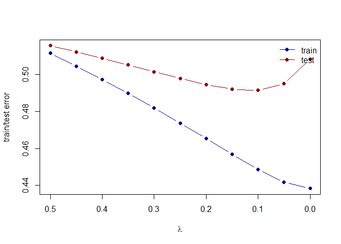
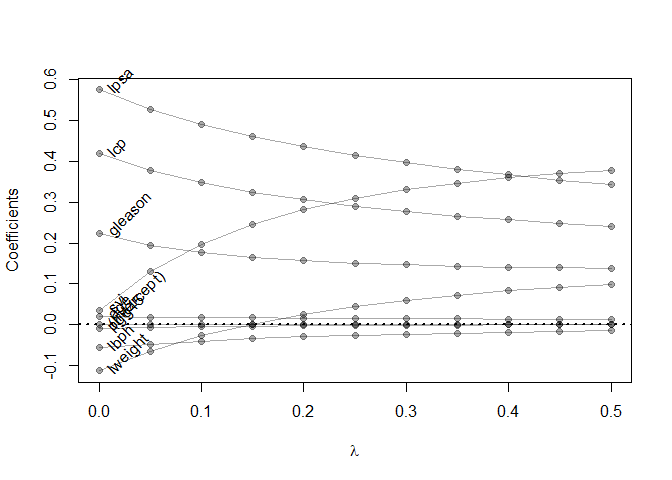

Homework - 3
================
Sriram Kannan

``` r
library(glmnet)
```

    ## Warning: package 'glmnet' was built under R version 4.1.2

    ## Loading required package: Matrix

    ## Loaded glmnet 4.1-3

``` r
library(tidyverse)
```

    ## -- Attaching packages --------------------------------------- tidyverse 1.3.1 --

    ## v ggplot2 3.3.5     v purrr   0.3.4
    ## v tibble  3.1.4     v dplyr   1.0.7
    ## v tidyr   1.1.4     v stringr 1.4.0
    ## v readr   2.0.2     v forcats 0.5.1

    ## -- Conflicts ------------------------------------------ tidyverse_conflicts() --
    ## x tidyr::expand() masks Matrix::expand()
    ## x dplyr::filter() masks stats::filter()
    ## x dplyr::lag()    masks stats::lag()
    ## x tidyr::pack()   masks Matrix::pack()
    ## x tidyr::unpack() masks Matrix::unpack()

``` r
prostate <- 
  read.table(url(
    'https://web.stanford.edu/~hastie/ElemStatLearn/datasets/prostate.data'))
```

``` r
## subset to training examples
prostate_train <- subset(prostate, train==TRUE) %>% select(-train)
```

Use the cor function to reproduce the correlations listed in HTF Table
3.1, page 50.

``` r
cor(prostate_train, use = "everything")
```

    ##             lcavol    lweight       age        lbph        svi         lcp
    ## lcavol  1.00000000 0.30023199 0.2863243  0.06316772  0.5929491  0.69204308
    ## lweight 0.30023199 1.00000000 0.3167235  0.43704154  0.1810545  0.15682859
    ## age     0.28632427 0.31672347 1.0000000  0.28734645  0.1289023  0.17295140
    ## lbph    0.06316772 0.43704154 0.2873464  1.00000000 -0.1391468 -0.08853456
    ## svi     0.59294913 0.18105448 0.1289023 -0.13914680  1.0000000  0.67124021
    ## lcp     0.69204308 0.15682859 0.1729514 -0.08853456  0.6712402  1.00000000
    ## gleason 0.42641407 0.02355821 0.3659151  0.03299215  0.3068754  0.47643684
    ## pgg45   0.48316136 0.07416632 0.2758057 -0.03040382  0.4813577  0.66253335
    ## lpsa    0.73315515 0.48521519 0.2276424  0.26293763  0.5568864  0.48920320
    ##            gleason       pgg45      lpsa
    ## lcavol  0.42641407  0.48316136 0.7331551
    ## lweight 0.02355821  0.07416632 0.4852152
    ## age     0.36591512  0.27580573 0.2276424
    ## lbph    0.03299215 -0.03040382 0.2629376
    ## svi     0.30687537  0.48135774 0.5568864
    ## lcp     0.47643684  0.66253335 0.4892032
    ## gleason 1.00000000  0.75705650 0.3424278
    ## pgg45   0.75705650  1.00000000 0.4480480
    ## lpsa    0.34242781  0.44804795 1.0000000

Treat lcavol as the outcome, and use all other variables in the data set
as predictors. With the training subset of the prostate data, train a
least-squares regression model with all predictors using the lm
function.

``` r
fit <- fit <- lm(lcavol ~ ., data=prostate_train)
summary(fit)
```

    ## 
    ## Call:
    ## lm(formula = lcavol ~ ., data = prostate_train)
    ## 
    ## Residuals:
    ##      Min       1Q   Median       3Q      Max 
    ## -1.71027 -0.50138  0.03103  0.51352  1.35376 
    ## 
    ## Coefficients:
    ##              Estimate Std. Error t value Pr(>|t|)    
    ## (Intercept) -2.173357   1.526699  -1.424    0.160    
    ## lweight     -0.113370   0.236639  -0.479    0.634    
    ## age          0.020102   0.013571   1.481    0.144    
    ## lbph        -0.056981   0.072525  -0.786    0.435    
    ## svi          0.035116   0.313526   0.112    0.911    
    ## lcp          0.418455   0.099521   4.205 9.16e-05 ***
    ## gleason      0.224387   0.198812   1.129    0.264    
    ## pgg45       -0.009113   0.005451  -1.672    0.100 .  
    ## lpsa         0.575455   0.107235   5.366 1.47e-06 ***
    ## ---
    ## Signif. codes:  0 '***' 0.001 '**' 0.01 '*' 0.05 '.' 0.1 ' ' 1
    ## 
    ## Residual standard error: 0.7116 on 58 degrees of freedom
    ## Multiple R-squared:  0.7118, Adjusted R-squared:  0.672 
    ## F-statistic:  17.9 on 8 and 58 DF,  p-value: 3.999e-13

``` r
coef(fit)
```

    ## (Intercept)     lweight         age        lbph         svi         lcp 
    ## -2.17335699 -0.11336968  0.02010188 -0.05698125  0.03511645  0.41845469 
    ##     gleason       pgg45        lpsa 
    ##  0.22438690 -0.00911273  0.57545508

``` r
residuals(fit)
```

    ##           1           2           3           4           5           6 
    ##  0.30510051 -0.36214995 -0.31372527 -0.57604668  1.00855250 -0.80121337 
    ##           8          11          12          13          14          16 
    ##  0.93154303 -0.04430734 -1.45525306  1.00784627  0.84369636  1.05697269 
    ##          17          18          19          20          21          23 
    ## -1.07296621  1.10894970 -0.58433985 -0.20987943  0.73401898 -0.96212934 
    ##          24          27          29          30          31          33 
    ##  0.60155186  0.08773062  0.30844179  0.46587959 -0.39203706  0.51616536 
    ##          35          37          38          39          40          41 
    ## -1.00794601 -1.08327905 -0.58060313  0.68114682 -0.52751225 -0.16747733 
    ##          43          45          46          47          51          52 
    ## -0.46010692  0.15965010  0.70751569  0.13993772  0.20829842  0.83814762 
    ##          56          58          59          60          61          63 
    ##  0.30174358 -0.21418255 -0.61609540  0.27427103 -0.59282089  0.37445320 
    ##          67          68          69          70          71          72 
    ##  0.20410928  0.51088167 -1.71027355 -0.30736902 -0.18635786 -0.24666610 
    ##          75          76          77          78          79          81 
    ##  0.03553988  0.23104706  0.17458591  0.89281112 -0.27734203 -0.62839982 
    ##          82          83          85          86          87          88 
    ## -0.06963027  0.03103464 -0.65441115  0.38724844  0.66414753 -0.63266711 
    ##          89          90          91          92          93          94 
    ## -0.25266290 -0.87963313  1.35375660  0.70838106 -0.13844098  0.62802337 
    ##          96 
    ## -0.47525498

Use the testing subset to compute the test error (average squared-error
loss) using the fitted least-squares regression model.

``` r
prostate_test <- subset(prostate, train==FALSE) %>% select(-train)
```

``` r
L2_loss <- function(y, yhat)
  (y-yhat)^2
error <- function(dat, fit, loss=L2_loss)
  mean(loss(dat$lcavol, predict(fit, newdata=dat)))
```

``` r
error(prostate_train, fit)
```

    ## [1] 0.4383709

``` r
error(prostate_test, fit)
```

    ## [1] 0.5084068

Train a ridge regression model using the glmnet function, and tune the
value of lambda (i.e., use guess and check to find the value of lambda
that approximately minimizes the test error).

``` r
form  <- lcavol ~  lweight + age + lbph + lcp + pgg45 + lpsa + svi + gleason
x_inp <- model.matrix(form, data=prostate_train)
y_out <- prostate_train$lcavol
fit <- glmnet(x=x_inp, y=y_out, lambda=seq(0.5, 0, -0.05), alpha = 0)
print(fit$beta)
```

    ## 9 x 11 sparse Matrix of class "dgCMatrix"

    ##    [[ suppressing 11 column names 's0', 's1', 's2' ... ]]

    ##                                                                    
    ## (Intercept)  .             .             .             .           
    ## lweight      0.0993164708  9.167566e-02  0.0826683948  0.0719539791
    ## age          0.0129153943  1.324527e-02  0.0136179441  0.0140406458
    ## lbph        -0.0145798645 -1.634009e-02 -0.0183250211 -0.0206075810
    ## lcp          0.2406189663  2.481045e-01  0.2566365965  0.2662889674
    ## pgg45        0.0002559092 -6.282802e-05 -0.0004352183 -0.0008738898
    ## lpsa         0.3427088262  3.542773e-01  0.3670625828  0.3813402190
    ## svi          0.3767521726  3.693591e-01  0.3595330020  0.3468674180
    ## gleason      0.1379543516  1.394770e-01  0.1413173561  0.1436779615
    ##                                                                             
    ## (Intercept)  .            .            .            .            .          
    ## lweight      0.059127616  0.043652593  0.024777969  0.001504802 -0.027603986
    ## age          0.014526957  0.015088490  0.015748487  0.016532948  0.017480107
    ## lbph        -0.023258103 -0.026377963 -0.030098852 -0.034621150 -0.040241264
    ## lcp          0.277447149  0.290342311  0.305728439  0.324372008  0.347616547
    ## pgg45       -0.001398912 -0.002031353 -0.002810371 -0.003788173 -0.005050263
    ## lpsa         0.397429712  0.415786556  0.437009864  0.461951799  0.491849702
    ## svi          0.330415198  0.309283880  0.281608260  0.245177911  0.196427346
    ## gleason      0.146778188  0.150949425  0.156678907  0.164800413  0.176722769
    ##                                      
    ## (Intercept)  .            .          
    ## lweight     -0.064680201 -0.113137304
    ## age          0.018643148  0.020098181
    ## lbph        -0.047425776 -0.056962692
    ## lcp          0.377657417  0.418431830
    ## pgg45       -0.006739814 -0.009116838
    ## lpsa         0.528596455  0.575318051
    ## svi          0.129711598  0.035342349
    ## gleason      0.194999807  0.224585243

``` r
error <- function(dat, fit, lam, form, loss=L2_loss) {
  x_inp <- model.matrix(form, data=dat)
  y_out <- dat$lcavol
  y_hat <- predict(fit, newx=x_inp, s=lam)
  mean(loss(y_out, y_hat))
}
```

Create a figure that shows the training and test error associated with
ridge regression as a function of lambda

``` r
## compute training and testing errors as function of lambda
err_train_1 <- sapply(fit$lambda, function(lam) 
  error(prostate_train, fit, lam, form))
err_test_1 <- sapply(fit$lambda, function(lam) 
  error(prostate_test, fit, lam, form))
```

``` r
plot(x=range(fit$lambda),
     y=range(c(err_train_1, err_test_1)),
     xlim=rev(range(fit$lambda)),
     type='n',
     xlab=expression(lambda),
     ylab='train/test error')
points(fit$lambda, err_train_1, pch=19, type='b', col='darkblue')
points(fit$lambda, err_test_1, pch=19, type='b', col='darkred')
legend('topright', c('train','test'), lty=1, pch=19,
       col=c('darkblue','darkred'), bty='n')
```

<!-- -->

``` r
colnames(fit$beta) <- paste('lam =', fit$lambda)
print(fit$beta %>% as.matrix)
```

    ##                 lam = 0.5    lam = 0.45     lam = 0.4    lam = 0.35
    ## (Intercept)  0.0000000000  0.000000e+00  0.0000000000  0.0000000000
    ## lweight      0.0993164708  9.167566e-02  0.0826683948  0.0719539791
    ## age          0.0129153943  1.324527e-02  0.0136179441  0.0140406458
    ## lbph        -0.0145798645 -1.634009e-02 -0.0183250211 -0.0206075810
    ## lcp          0.2406189663  2.481045e-01  0.2566365965  0.2662889674
    ## pgg45        0.0002559092 -6.282802e-05 -0.0004352183 -0.0008738898
    ## lpsa         0.3427088262  3.542773e-01  0.3670625828  0.3813402190
    ## svi          0.3767521726  3.693591e-01  0.3595330020  0.3468674180
    ## gleason      0.1379543516  1.394770e-01  0.1413173561  0.1436779615
    ##                lam = 0.3   lam = 0.25    lam = 0.2   lam = 0.15    lam = 0.1
    ## (Intercept)  0.000000000  0.000000000  0.000000000  0.000000000  0.000000000
    ## lweight      0.059127616  0.043652593  0.024777969  0.001504802 -0.027603986
    ## age          0.014526957  0.015088490  0.015748487  0.016532948  0.017480107
    ## lbph        -0.023258103 -0.026377963 -0.030098852 -0.034621150 -0.040241264
    ## lcp          0.277447149  0.290342311  0.305728439  0.324372008  0.347616547
    ## pgg45       -0.001398912 -0.002031353 -0.002810371 -0.003788173 -0.005050263
    ## lpsa         0.397429712  0.415786556  0.437009864  0.461951799  0.491849702
    ## svi          0.330415198  0.309283880  0.281608260  0.245177911  0.196427346
    ## gleason      0.146778188  0.150949425  0.156678907  0.164800413  0.176722769
    ##               lam = 0.05      lam = 0
    ## (Intercept)  0.000000000  0.000000000
    ## lweight     -0.064680201 -0.113137304
    ## age          0.018643148  0.020098181
    ## lbph        -0.047425776 -0.056962692
    ## lcp          0.377657417  0.418431830
    ## pgg45       -0.006739814 -0.009116838
    ## lpsa         0.528596455  0.575318051
    ## svi          0.129711598  0.035342349
    ## gleason      0.194999807  0.224585243

Create a path diagram of the ridge regression analysis, similar to HTF
Figure 3.8

``` r
plot(x=range(fit$lambda),
     y=range(as.matrix(fit$beta)),
     type='n',
     xlab=expression(lambda),
     ylab='Coefficients')
for(i in 1:nrow(fit$beta)) {
  points(x=fit$lambda, y=fit$beta[i,], pch=19, col='#00000055')
  lines(x=fit$lambda, y=fit$beta[i,], col='#00000055')
}
text(x=0, y=fit$beta[,ncol(fit$beta)], 
     labels=rownames(fit$beta),
     xpd=NA, pos=4, srt=45)
abline(h=0, lty=3, lwd=2)
```

<!-- -->
