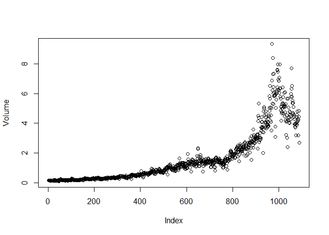

Homework - 4
================
Sriram Kannan

When the number of features p is large, there tends to be a
deterioration in the performance of KNN and other local approaches that
perform prediction using only observations that are near the test
observation for which a prediction must be made. This phenomenon is
known as the curse of dimensionality, and it ties into the fact that
parametric approaches often perform poorly when p is large. We will now
investigate this curse.

1.  Suppose that we have a set of observations, each with measurements
    on p = 1 feature, X. We assume that X is uniformly (evenly)
    distributed on \[0, 1\]. Associated with each observation is a
    response value. Suppose that we wish to predict a test observation’s
    response using only observations that are within 10% of the range of
    X closest to that test observation. For instance, in order to
    predict the response for a test observation with X = 0.6, we will
    use observations in the range \[0.55, 0.65\]. On average, what
    fraction of the available observations will we use to make the
    prediction?

``` r
inc = sum(seq(from = 5, to = 9.999999, by = 0.000001)/1000000)
dec = sum(seq(from = 9.999999, to = 5, by = -0.000001)/1000000)
(inc + 10*90 + dec)/100
```

    ## [1] 9.75

On average 9.5% of the observations are utilized as over 90 or below 10
of the given domain \[0,1\], we lose values on the right hand side of X
or left hand side of X respectively due to 1 and 0 being hard limits.
Here, inc and dec are sequenced as simulations of uniform continuous
distributions for values below 10 and above 90 to showcase the loss of
values due to domain limits in each of their conditions. In case of the
remianing values where the full 10% of the observations can be used, a
continuous or a discrete distribution each average out to 10 hence,
10\*90 is shown for the sake of simplicity.

2.  Now suppose that we have a set of observations, each with
    measurements on p = 2 features, X1 and X2. We assume that (X1,X2)
    are uniformly distributed on \[0, 1\] × \[0, 1\]. We wish to predict
    a test observation’s response using only observations that are
    within 10% of the range of X1 and within 10% of the range of X2
    closest to that test observation. For instance, in order to predict
    the response for a test observation with X1 = 0.6 and X2 = 0.35, we
    will use observations in the range \[0.55, 0.65\] for X1 and in the
    range \[0.3, 0.4\] for X2. On average, what fraction of the
    available observations will we use to make the prediction?

``` r
sqrt(9.75)
```

    ## [1] 3.122499

We have doubled the dimensions while having the same number of points.
Here we consider 2-D points with co-ordinates X1 and X2. Consider a
hypercube or a hypersphere - the volume of the space is increases
exponentially with increase in dimensions. We thus only use 3.122% of
the observations when we have 2 dimensions.

3.  Now suppose that we have a set of observations on p = 100 features.
    Again the observations are uniformly distributed on each feature,
    and again each feature ranges in value from 0 to 1. We wish to
    predict a test observation’s response using observations within the
    10% of each feature’s range that is closest to that test
    observation. What fraction of the available observations will we use
    to make the prediction?

``` r
9.75^(1/100)
```

    ## [1] 1.023034

Similarly, we only use 1.023% of the observations when we have 100
dimensions.

4.  Using your answers to parts (a)–(c), argue that a drawback of KNN
    when p is large is that there are very few training observations
    “near” any given test observation.

As can be seen in the previous answers, we’re using less and less
fractions of available observations precisely due to the fact that the
density of observations exponentially decrease as the volume of the
“hyperspace - i.e, space in n dimensions” increases. Thereby we conclude
that there are very few training observations “near” any test
observation. The “nearness” becomes harder and harder to discern as
dimensions increase as explained further below.

5.  Now suppose that we wish to make a prediction for a test observation
    by creating a p-dimensional hypercube centered around the test
    observation that contains, on average, 10% of the training
    observations. For p = 1, 2, and 100, what is the length of each side
    of the hypercube? Comment on your answer. Note: A hypercube is a
    generalization of a cube to an arbitrary number of dimensions. When
    p = 1, a hypercube is simply a line segment, when p = 2 it is a
    square, and when p = 100 it is a 100-dimensional cube.

Edge Length of Hypercube ep = f^1/p Plugging in the values, we have f =
0.1 (As test observations contain 10% of the training observations)

``` r
e1 = 0.1^(1/1)
e2 = 0.1^(1/2)
e3 = 0.1^(1/100)
e1
```

    ## [1] 0.1

``` r
e2
```

    ## [1] 0.3162278

``` r
e3
```

    ## [1] 0.9772372

As we can see, the length of the hypercube increases as the dimensions
increase. Considering the maximum possible length is 1 (While using all
observations in 1 dimension), we see that in order to utilize 10% of the
training observations, in higher dimensions we’d have to search
disproportionately farther away in order to find the values we need.
There’s a lot of empty space in high dimensions and hence it’s very
difficult to find observations that are close by. In case of 100
dimensions, we have to use 97.7% of the maximum length of the hypercube
to get merely 10% of the observations showing how much farther apart the
observations are. The key observation here is that the scaling is
severly non-linear. In order to get 20% of the observations, we’d have
to use 98.4% of the length and the difference decreases as we increase
the % of observations used. The huge drawback here is that there’s
little difference between the closest point and the other points that
are farther away. “Nearest Neighbours” loses its meaning to a large
degree as the degree of “nearness” massively reduces as dimensions
increase and becomes increasingly hard to ascertain when we reduce the
fraction of neighbours we consider as “nearest”.

13. This question should be answered using the Weekly data set, which is
    part of the ISLR2 package. This data is similar in nature to the
    Smarket data from this chapter’s lab, except that it contains 1, 089
    weekly returns for 21 years, from the beginning of 1990 to the end
    of 2010.

``` r
library(ISLR2)
```

    ## Warning: package 'ISLR2' was built under R version 4.1.2

1.  Produce some numerical and graphical summaries of the Weekly data.
    Do there appear to be any patterns?

``` r
summary(Weekly)
```

    ##       Year           Lag1               Lag2               Lag3         
    ##  Min.   :1990   Min.   :-18.1950   Min.   :-18.1950   Min.   :-18.1950  
    ##  1st Qu.:1995   1st Qu.: -1.1540   1st Qu.: -1.1540   1st Qu.: -1.1580  
    ##  Median :2000   Median :  0.2410   Median :  0.2410   Median :  0.2410  
    ##  Mean   :2000   Mean   :  0.1506   Mean   :  0.1511   Mean   :  0.1472  
    ##  3rd Qu.:2005   3rd Qu.:  1.4050   3rd Qu.:  1.4090   3rd Qu.:  1.4090  
    ##  Max.   :2010   Max.   : 12.0260   Max.   : 12.0260   Max.   : 12.0260  
    ##       Lag4               Lag5              Volume            Today         
    ##  Min.   :-18.1950   Min.   :-18.1950   Min.   :0.08747   Min.   :-18.1950  
    ##  1st Qu.: -1.1580   1st Qu.: -1.1660   1st Qu.:0.33202   1st Qu.: -1.1540  
    ##  Median :  0.2380   Median :  0.2340   Median :1.00268   Median :  0.2410  
    ##  Mean   :  0.1458   Mean   :  0.1399   Mean   :1.57462   Mean   :  0.1499  
    ##  3rd Qu.:  1.4090   3rd Qu.:  1.4050   3rd Qu.:2.05373   3rd Qu.:  1.4050  
    ##  Max.   : 12.0260   Max.   : 12.0260   Max.   :9.32821   Max.   : 12.0260  
    ##  Direction 
    ##  Down:484  
    ##  Up  :605  
    ##            
    ##            
    ##            
    ## 

``` r
cor(Weekly[-9])
```

    ##               Year         Lag1        Lag2        Lag3         Lag4
    ## Year    1.00000000 -0.032289274 -0.03339001 -0.03000649 -0.031127923
    ## Lag1   -0.03228927  1.000000000 -0.07485305  0.05863568 -0.071273876
    ## Lag2   -0.03339001 -0.074853051  1.00000000 -0.07572091  0.058381535
    ## Lag3   -0.03000649  0.058635682 -0.07572091  1.00000000 -0.075395865
    ## Lag4   -0.03112792 -0.071273876  0.05838153 -0.07539587  1.000000000
    ## Lag5   -0.03051910 -0.008183096 -0.07249948  0.06065717 -0.075675027
    ## Volume  0.84194162 -0.064951313 -0.08551314 -0.06928771 -0.061074617
    ## Today  -0.03245989 -0.075031842  0.05916672 -0.07124364 -0.007825873
    ##                Lag5      Volume        Today
    ## Year   -0.030519101  0.84194162 -0.032459894
    ## Lag1   -0.008183096 -0.06495131 -0.075031842
    ## Lag2   -0.072499482 -0.08551314  0.059166717
    ## Lag3    0.060657175 -0.06928771 -0.071243639
    ## Lag4   -0.075675027 -0.06107462 -0.007825873
    ## Lag5    1.000000000 -0.05851741  0.011012698
    ## Volume -0.058517414  1.00000000 -0.033077783
    ## Today   0.011012698 -0.03307778  1.000000000

The only high correlation that is observed is between Year and Volume.
The plot below shows this trend. The rise in index corresponds to the
passage of weeks over time and hence is a time series starting from 1990
- 2009 in Week Numbers.

``` r
attach(Weekly)
plot(Volume)
```

<!-- -->

2.  Use the full data set to perform a logistic regression with
    Direction as the response and the five lag variables plus Volume as
    predictors. Use the summary function to print the results. Do any of
    the predictors appear to be statistically significant? If so, which
    ones?

``` r
glm.fits <- glm(
Direction ~ Lag1 + Lag2 + Lag3 + Lag4 + Lag5 + Volume ,
data = Weekly , family = binomial)
summary(glm.fits)
```

    ## 
    ## Call:
    ## glm(formula = Direction ~ Lag1 + Lag2 + Lag3 + Lag4 + Lag5 + 
    ##     Volume, family = binomial, data = Weekly)
    ## 
    ## Deviance Residuals: 
    ##     Min       1Q   Median       3Q      Max  
    ## -1.6949  -1.2565   0.9913   1.0849   1.4579  
    ## 
    ## Coefficients:
    ##             Estimate Std. Error z value Pr(>|z|)   
    ## (Intercept)  0.26686    0.08593   3.106   0.0019 **
    ## Lag1        -0.04127    0.02641  -1.563   0.1181   
    ## Lag2         0.05844    0.02686   2.175   0.0296 * 
    ## Lag3        -0.01606    0.02666  -0.602   0.5469   
    ## Lag4        -0.02779    0.02646  -1.050   0.2937   
    ## Lag5        -0.01447    0.02638  -0.549   0.5833   
    ## Volume      -0.02274    0.03690  -0.616   0.5377   
    ## ---
    ## Signif. codes:  0 '***' 0.001 '**' 0.01 '*' 0.05 '.' 0.1 ' ' 1
    ## 
    ## (Dispersion parameter for binomial family taken to be 1)
    ## 
    ##     Null deviance: 1496.2  on 1088  degrees of freedom
    ## Residual deviance: 1486.4  on 1082  degrees of freedom
    ## AIC: 1500.4
    ## 
    ## Number of Fisher Scoring iterations: 4

Based on the P-Values, We can conclude that Lag 2 is statistically
significant as it has a p-value &lt; 0.05.

3.  Compute the confusion matrix and overall fraction of correct
    predictions. Explain what the confusion matrix is telling you about
    the types of mistakes made by logistic regression.

``` r
glm.probs <- predict(glm.fits , type = "response")
glm.pred <- rep("Down", 1089)
glm.pred[glm.probs > .5] = "Up"
table(glm.pred , Direction)
```

    ##         Direction
    ## glm.pred Down  Up
    ##     Down   54  48
    ##     Up    430 557

``` r
mean(glm.pred == Direction)
```

    ## [1] 0.5610652

The confusion matrix shows both the false positives - The number of
predictions that were Down but were predicted as Up = 48 and the false
negatives, i.e the number of Predictions that were Up but predicted as
Down = 430.

4.  Now fit the logistic regression model using a training data period
    from 1990 to 2008, with Lag2 as the only predictor. Compute the
    confusion matrix and the overall fraction of correct predictions for
    the held out data (that is, the data from 2009 and 2010).

``` r
train <- (Year <= 2008)
Weekly.2008 = Weekly[!train, ]
Direction.2008 <- Direction[!train]

glm.fits <- glm(
Direction ~ Lag2 ,
data = Weekly , family = binomial , subset = train
)
glm.probs <- predict(glm.fits , Weekly.2008,
type = "response")

glm.pred <- rep("Down", 104)
glm.pred[glm.probs > .5] <- "Up"
table(glm.pred , Direction.2008)
```

    ##         Direction.2008
    ## glm.pred Down Up
    ##     Down    9  5
    ##     Up     34 56

``` r
mean(glm.pred != Direction.2008)
```

    ## [1] 0.375

The overall fraction of correct predictions for the held out data/test
data is 0.375 in case of Logistic Regression.

5.  Repeat (d) using LDA.

``` r
library(MASS)
```

    ## 
    ## Attaching package: 'MASS'

    ## The following object is masked from 'package:ISLR2':
    ## 
    ##     Boston

``` r
lda.fit <- lda(Direction ~ Lag2 , data = Weekly , subset = train)
lda.pred <- predict(lda.fit , Weekly.2008)
lda.class <- lda.pred$class
table(lda.class, Direction.2008)
```

    ##          Direction.2008
    ## lda.class Down Up
    ##      Down    9  5
    ##      Up     34 56

``` r
mean(lda.class == Direction.2008)
```

    ## [1] 0.625

The overall fraction of correct predictions for the held out data/test
data is 0.625 in case of LDA.

6.  Repeat (d) using QDA.

``` r
qda.fit <- qda(Direction ~ Lag2 , data = Weekly , subset = train)
qda.pred <- predict(qda.fit , Weekly.2008)
qda.class <- qda.pred$class
table(qda.class, Direction.2008)
```

    ##          Direction.2008
    ## qda.class Down Up
    ##      Down    0  0
    ##      Up     43 61

``` r
mean(qda.class == Direction.2008)
```

    ## [1] 0.5865385

The overall fraction of correct predictions for the held out data/test
data is 0.5865 in case of QDA.

7.  Repeat (d) using KNN with K = 1.

``` r
library(class)
library(tidyverse)
```

    ## -- Attaching packages --------------------------------------- tidyverse 1.3.1 --

    ## v ggplot2 3.3.5     v purrr   0.3.4
    ## v tibble  3.1.4     v dplyr   1.0.7
    ## v tidyr   1.1.4     v stringr 1.4.0
    ## v readr   2.0.2     v forcats 0.5.1

    ## -- Conflicts ------------------------------------------ tidyverse_conflicts() --
    ## x dplyr::filter() masks stats::filter()
    ## x dplyr::lag()    masks stats::lag()
    ## x dplyr::select() masks MASS::select()

``` r
train.X <- Weekly %>% filter(Year <= 2008) %>% select(Lag2)
test.X <- Weekly %>% filter(Year > 2008) %>% select(Lag2)
train.Direction <- Direction[train]
set.seed (1)
knn.pred <- knn(train.X, test.X, train.Direction , k = 1)
table(knn.pred , Direction.2008)
```

    ##         Direction.2008
    ## knn.pred Down Up
    ##     Down   21 30
    ##     Up     22 31

``` r
mean(knn.pred == Direction.2008)
```

    ## [1] 0.5

The overall fraction of correct predictions for the held out data/test
data is 0.5 in case of KNN using K = 1.

8.  Repeat (d) using naive Bayes.

``` r
library(e1071)
nb.fit <- naiveBayes(Direction ~ Lag2 , data = Weekly, subset = train)
nb.class <- predict(nb.fit , Weekly.2008)
table(nb.class , Direction.2008)
```

    ##         Direction.2008
    ## nb.class Down Up
    ##     Down    0  0
    ##     Up     43 61

``` r
mean(nb.class == Direction.2008)
```

    ## [1] 0.5865385

The overall fraction of correct predictions for the held out data/test
data is 0.5865 in case of Naive Bayes.

1.  Which of these methods appears to provide the best results on this
    data?

Based on the Parameters used, for the Weekly Data using Lag2 as the sole
predictor, LDA appears to provide the best results.

10. Experiment with different combinations of predictors, including
    possible transformations and interactions, for each of the methods.
    Report the variables, method, and associated confusion matrix that
    appears to provide the best results on the held out data. Note that
    you should also experiment with values for K in the KNN classifier.

``` r
#Logistic Regression  - Using Lag1, 2 and 4 (Least 3 P-values)
glm.fits <- glm(
Direction ~  Lag1 + Lag2 - Lag4,
data = Weekly , family = binomial , subset = train
)
glm.probs <- predict(glm.fits , Weekly.2008,
type = "response")

glm.pred <- rep("Down", 104)
glm.pred[glm.probs > .5] <- "Up"
table(glm.pred , Direction.2008)
```

    ##         Direction.2008
    ## glm.pred Down Up
    ##     Down    7  8
    ##     Up     36 53

``` r
mean(glm.pred != Direction.2008)
```

    ## [1] 0.4230769

We get a better prediction with Logistic Regression now, with using Lag
1, 2 and 4 in a different interaction that just using Lag 2. It still
however, is lower than LDA with just Lag2.

``` r
#QDA
qda.fit <- qda(Direction ~ Lag1 + Lag2 - Lag4 , data = Weekly , subset = train)
qda.pred <- predict(qda.fit , Weekly.2008)
qda.class <- qda.pred$class
table(qda.class, Direction.2008)
```

    ##          Direction.2008
    ## qda.class Down Up
    ##      Down    7 10
    ##      Up     36 51

``` r
mean(qda.class == Direction.2008)
```

    ## [1] 0.5576923

We see a deterioration in the performance of QDA when using the same
interaction with Lag1, Lag2 and Lag4 as above over the original model
with just Lag2.

``` r
#Naive Bayes
nb.fit <- naiveBayes(Direction ~ Lag1 + Lag2 - Lag4 , data = Weekly, subset = train)
nb.class <- predict(nb.fit , Weekly.2008)
table(nb.class , Direction.2008)
```

    ##         Direction.2008
    ## nb.class Down Up
    ##     Down    3  8
    ##     Up     40 53

``` r
mean(nb.class == Direction.2008)
```

    ## [1] 0.5384615

We see a deterioration in the performance of Naive Bayes when using the
same interaction with Lag1, Lag2 and Lag4 as above over the original
model with just Lag2.

``` r
train.X <- Weekly %>% filter(Year <= 2008) %>% select(Lag2)
test.X <- Weekly %>% filter(Year > 2008) %>% select(Lag2)
train.Direction <- Direction[train]
set.seed (1)
knn.pred <- knn(train.X, test.X, train.Direction , k = 20)
table(knn.pred , Direction.2008)
```

    ##         Direction.2008
    ## knn.pred Down Up
    ##     Down   21 21
    ##     Up     22 40

``` r
mean(knn.pred == Direction.2008)
```

    ## [1] 0.5865385

In case of KNN, Using K = 20, We see an increase in model accuracy as
opposed to using K = 1 with the same Lag2 as the predictor. Is is still
however, lower than the accuracy of the original LDA model.

``` r
lda.fit <- lda(Direction ~ Lag1 + Lag2 - Lag4 , data = Weekly , subset = train)
lda.pred <- predict(lda.fit , Weekly.2008)
lda.class <- lda.pred$class
table(lda.class, Direction.2008)
```

    ##          Direction.2008
    ## lda.class Down Up
    ##      Down    7  8
    ##      Up     36 53

``` r
mean(lda.class == Direction.2008)
```

    ## [1] 0.5769231

We see a deterioration in the performance of LDA when using the same
interaction with Lag1, Lag2 and Lag4 as above over the original model
with just Lag2.

We thus conclude that the original LDA model with an accuracy of 0.625
provides the best predictions with just Lag2 being used as the
predictor. Which is understandable as that’s the only statistically
significant predictor based on the P-values with only Logistic
Regression breaking this trend but still falling lower than LDA.
