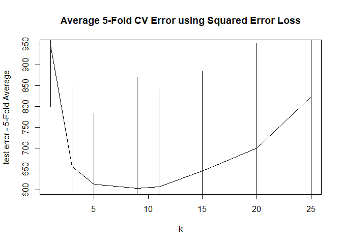

Homework - 5
================
Sriram Kannan

1.  Randomly split the mcycle data into training (75%) and validation
    (25%) subsets.

``` r
library(MASS)
library(ISLR2)
```

    ## Warning: package 'ISLR2' was built under R version 4.1.2

    ## 
    ## Attaching package: 'ISLR2'

    ## The following object is masked from 'package:MASS':
    ## 
    ##     Boston

``` r
set.seed(200)
index <- sample(133,0.75*133)
train <- mcycle[index, ]
test <- mcycle[-index, ]
train
```

    ##     times  accel
    ## 114  41.6   30.8
    ## 44   16.6  -59.0
    ## 26   14.6  -16.0
    ## 64   21.8 -108.4
    ## 82   27.2  -45.6
    ## 54   18.6 -112.5
    ## 91   30.2   36.2
    ## 56   19.2 -123.1
    ## 27   14.6  -22.8
    ## 132  55.4   -2.7
    ## 24   14.6   -5.4
    ## 61   20.4 -117.9
    ## 20   13.6   -2.7
    ## 118  42.8  -10.7
    ## 127  50.6    0.0
    ## 72   25.0  -64.4
    ## 100  34.8   75.0
    ## 31   15.4  -53.5
    ## 70   24.2  -81.8
    ## 109  38.0   10.7
    ## 38   16.0  -26.8
    ## 94   32.0   54.9
    ## 87   28.4  -21.5
    ## 6     6.2   -2.7
    ## 3     3.2   -2.7
    ## 43   16.4  -80.4
    ## 99   34.4    1.3
    ## 101  35.2  -16.0
    ## 1     2.4    0.0
    ## 128  52.0   10.7
    ## 103  35.4   69.6
    ## 122  45.0   10.7
    ## 18   11.4    0.0
    ## 25   14.6   -9.3
    ## 86   28.2   12.0
    ## 4     3.6    0.0
    ## 62   21.2 -134.0
    ## 51   17.6 -101.9
    ## 52   17.8  -99.1
    ## 85   27.6    4.0
    ## 88   28.4   37.5
    ## 112  40.0  -21.5
    ## 104  35.6   34.8
    ## 78   26.2 -107.1
    ## 34   15.6  -21.5
    ## 102  35.2  -54.9
    ## 22   14.6  -13.3
    ## 116  42.4   29.4
    ## 111  39.4   -1.3
    ## 13    9.6   -2.7
    ## 53   17.8 -104.4
    ## 67   23.4 -128.5
    ## 57   19.4  -85.6
    ## 121  44.4    0.0
    ## 92   31.0   75.0
    ## 37   16.0  -42.9
    ## 30   15.4  -32.1
    ## 93   31.2    8.1
    ## 123  46.6   10.7
    ## 23   14.6   -5.4
    ## 115  41.6  -10.7
    ## 35   15.8  -21.5
    ## 97   33.4   16.0
    ## 105  35.6   32.1
    ## 96   32.8   46.9
    ## 126  48.8  -13.3
    ## 73   25.0  -57.6
    ## 63   21.4 -101.9
    ## 74   25.4  -72.3
    ## 19   13.2   -2.7
    ## 83   27.2  -24.2
    ## 36   15.8  -50.8
    ## 120  44.0   -1.3
    ## 5     4.0   -2.7
    ## 133  57.6   10.7
    ## 16   10.6   -2.7
    ## 9     7.8   -2.7
    ## 11    8.8   -1.3
    ## 60   20.2 -123.1
    ## 95   32.0   48.2
    ## 75   25.4  -44.3
    ## 89   28.6   46.9
    ## 12    8.8   -2.7
    ## 14   10.0   -2.7
    ## 131  55.0   10.7
    ## 48   17.6  -37.5
    ## 49   17.6  -85.6
    ## 45   16.8  -71.0
    ## 10    8.2   -2.7
    ## 42   16.4   -5.4
    ## 41   16.2  -61.7
    ## 46   16.8  -91.1
    ## 110  39.2    5.4
    ## 130  55.0   -2.7
    ## 113  40.4  -13.3
    ## 17   11.0   -5.4
    ## 8     6.8   -1.3
    ## 15   10.2   -5.4
    ## 2     2.6   -1.3

``` r
test
```

    ##     times  accel
    ## 7     6.6   -2.7
    ## 21   13.8    0.0
    ## 28   14.8   -2.7
    ## 29   15.4  -22.8
    ## 32   15.4  -54.9
    ## 33   15.6  -40.2
    ## 39   16.2  -21.5
    ## 40   16.2  -50.8
    ## 47   16.8  -77.7
    ## 50   17.6 -123.1
    ## 55   18.6  -50.8
    ## 58   19.4  -72.3
    ## 59   19.6 -127.2
    ## 65   22.0 -123.1
    ## 66   23.2 -123.1
    ## 68   24.0 -112.5
    ## 69   24.2  -95.1
    ## 71   24.6  -53.5
    ## 76   25.6  -26.8
    ## 77   26.0   -5.4
    ## 79   26.2  -21.5
    ## 80   26.4  -65.6
    ## 81   27.0  -16.0
    ## 84   27.2    9.5
    ## 90   29.4  -17.4
    ## 98   33.8   45.6
    ## 106  36.2  -37.5
    ## 107  36.2   22.8
    ## 108  38.0   46.9
    ## 117  42.8    0.0
    ## 119  43.0   14.7
    ## 124  47.8  -26.8
    ## 125  47.8  -14.7
    ## 129  53.2  -14.7

2.  Using the mcycle data, consider predicting the mean acceleration as
    a function of time. Use the Nadaraya-Watson method with the k-NN
    kernel function to create a series of prediction models by varying
    the tuning parameter over a sequence of values. (hint: the script
    already implements this)

``` r
## k-NN kernel function
## x  - n x p matrix of training inputs
## x0 - 1 x p input where to make prediction
## k  - number of nearest neighbors
kernel_k_nearest_neighbors <- function(x, x0, k=1) {
  ## compute distance betwen each x and x0
  z <- t(t(x) - x0)
  d <- sqrt(rowSums(z*z))

  ## initialize kernel weights to zero
  w <- rep(0, length(d))
  
  ## set weight to 1 for k nearest neighbors
  w[order(d)[1:k]] <- 1
  
  return(w)
}

## Make predictions using the NW method
## y  - n x 1 vector of training outputs
## x  - n x p matrix of training inputs
## x0 - m x p matrix where to make predictions
## kern  - kernel function to use
## ... - arguments to pass to kernel function
nadaraya_watson <- function(y, x, x0, kern, ...) {
  k <- t(apply(x0, 1, function(x0_) {
    k_ <- kern(x, x0_, ...)
    k_/sum(k_)
  }))
  yhat <- drop(k %*% y)
  attr(yhat, 'k') <- k
  return(yhat)
}

y <- mcycle$accel
x <- matrix(mcycle$times, length(mcycle$times), 1)
x_plot <- matrix(seq(min(x),max(x),length.out=133),133,1)
k_param = c(1,3,5,9,11,15,20,25)

for (i in k_param)
  {
    yhat_plot = nadaraya_watson(y = y,x = x,x0 = x_plot ,kern = kernel_k_nearest_neighbors, k = i)
    plot(x, y, xlab="Time (ms)", ylab="Acceleration (g)")
    lines(x_plot, yhat_plot, col="#882255", lwd=2)
  }
```

<!-- --><!-- --><!-- --><!-- --><!-- --><!-- --><!-- --><!-- -->

3.  With the squared-error loss function, compute and plot the training
    error, AIC, BIC, and validation error (using the validation data) as
    functions of the tuning parameter.

``` r
## loss function
## y    - train/test y
## yhat - predictions at train/test x
loss_squared_error <- function(y, yhat)
  (y - yhat)^2
```

``` r
## test/train error
## y    - train/test y
## yhat - predictions at train/test x
## loss - loss function
error <- function(y, yhat, loss=loss_squared_error)
  mean(loss(y, yhat))

y <- train$accel
x <- matrix(train$times, length(train$times), 1)
x_plot = matrix(seq(min(x),max(x),length.out=99),99,1)
v = c()
#Each value is tuned to a specific value of K as seen above. 
for (i in k_param)
  {
    yhat_plot = nadaraya_watson(y = y,x = x,x0 = x_plot ,kern = kernel_k_nearest_neighbors, k = i)
    v[i] = error(y, yhat_plot)
}
v<-v[!is.na(v)]
plot(k_param, v, xlab="k", ylab="train error", type = "l", main = "Train error using Squared Error Loss")
```

<!-- -->

``` r
## AIC
## y    - training y
## yhat - predictions at training x
## d    - effective degrees of freedom
effective_df <- function(y, x, kern, ...) {
  y_hat <- nadaraya_watson(y, x, x,
    kern=kern, ...)
  sum(diag(attr(y_hat, 'k')))
}


aic <- function(y, yhat, d)
  error(y, yhat) + 2/length(y)*d

df = c()
for (i in k_param)
  {
    yhat_plot = nadaraya_watson(y = y,x = x,x0 = x_plot ,kern = kernel_k_nearest_neighbors, k = i)
    df[i] = sum(diag(attr(yhat_plot, 'k')))
}
df <- df[!is.na(df)]
for (i in length(k_param))
  {
    v[i] = aic(y, yhat_plot, d = df[i])
}
plot(k_param, v, xlab="k", ylab="aic of training data", type = "l", main = "AIC Value of Training Data using Squared Error Loss")
```

<!-- -->

``` r
## BIC
## y    - training y
## yhat - predictions at training x
## d    - effective degrees of freedom
bic <- function(y, yhat, d)
  error(y, yhat) + log(length(y))/length(y)*d

for (i in length(k_param))
  {
    v[i] = bic(y, yhat_plot, d = df[i])
}
plot(k_param, v, xlab="k", ylab="bic of training data", type = "l", main = "BIC Value of Training Data using Squared Error Loss")
```

<!-- -->

``` r
y <- test$accel
x <- matrix(test$times, length(test$times), 1)
x_plot = matrix(seq(min(x),max(x),length.out=34),34,1)
v = c()
#Each value is tuned to a specific value of K as seen above.
for (i in k_param)
  {
    yhat_plot = nadaraya_watson(y = y,x = x,x0 = x_plot ,kern = kernel_k_nearest_neighbors, k = i)
    v[i] = error(y, yhat_plot)
}
v<-v[!is.na(v)]
plot(k_param, v, xlab="k", ylab="test error", type = "l", main = "Test error using Squared Error Loss")
```

<!-- -->

4.  For each value of the tuning parameter, Perform 5-fold
    cross-validation using the combined training and validation data.
    This results in 5 estimates of test error per tuning parameter
    value.

``` r
library(caret)
```

    ## Warning: package 'caret' was built under R version 4.1.3

    ## Loading required package: ggplot2

    ## Loading required package: lattice

``` r
library(matrixStats)
set.seed(100)
flds <- createFolds(mcycle$accel, k = 5)
print(flds)
```

    ## $Fold1
    ##  [1]   5  13  21  23  35  37  39  48  49  61  63  65  66  68  77  83  88  93 117
    ## [20] 119 123 126 127 128 133
    ## 
    ## $Fold2
    ##  [1]   4   8   9  10  11  15  19  30  31  38  41  44  47  53  56  73  80  84  87
    ## [20]  90  91 104 107 110 120 122 129
    ## 
    ## $Fold3
    ##  [1]   3  14  16  18  20  29  32  34  46  57  60  62  71  72  75  76  79  81  92
    ## [20]  94 102 103 108 114 116 118 121
    ## 
    ## $Fold4
    ##  [1]   2   6   7  17  22  27  33  42  43  45  51  52  55  67  70  78  82  85  89
    ## [20]  99 105 106 109 111 112 131 132
    ## 
    ## $Fold5
    ##  [1]   1  12  24  25  26  28  36  40  50  54  58  59  64  69  74  86  95  96  97
    ## [20]  98 100 101 113 115 124 125 130

``` r
sapply(flds, length)
```

    ## Fold1 Fold2 Fold3 Fold4 Fold5 
    ##    25    27    27    27    27

``` r
cvknn <- function(kNN = 10, flds = flds)
{
  cverr <- rep(NA, length(flds))
  for(tst_idx in 1:length(flds))
  {
    acc_trn <- mcycle[-flds[[tst_idx]],]
    acc_tst <- mcycle[flds[[tst_idx]],]
    
    knn_fit <- knnreg(accel ~ times, k = kNN, data = acc_trn)
    pre_tst <- predict(knn_fit, acc_tst)
    cverr[tst_idx] <- mean((acc_tst$accel - pre_tst)^2)
  }
  return(cverr)
}

cvvers = matrix(, nrow = length(k_param), ncol = 5)

for (i in 1:length(k_param))
{
  val <- cvknn(k_param[i], flds)
  cvvers[i,] <- val
}
cvvers
```

    ##          [,1]     [,2]     [,3]      [,4]      [,5]
    ## [1,] 997.6650 695.4783 968.1346 1080.4844  989.0818
    ## [2,] 587.1123 396.9731 846.0472  859.7604  586.6572
    ## [3,] 545.2505 398.1633 835.8301  730.2249  555.2788
    ## [4,] 569.9457 213.9730 800.2472  898.8261  530.8701
    ## [5,] 566.2010 245.9675 763.6965  861.9321  594.1729
    ## [6,] 589.6369 280.7410 803.4317  907.2119  641.0222
    ## [7,] 621.9942 296.4595 819.0443  940.8030  819.0434
    ## [8,] 756.8713 382.1016 986.5240  924.0095 1066.5006

``` r
cvvers_mean <- rowMeans(cvvers)
as.matrix(cvvers_mean)
```

    ##          [,1]
    ## [1,] 946.1688
    ## [2,] 655.3100
    ## [3,] 612.9495
    ## [4,] 602.7724
    ## [5,] 606.3940
    ## [6,] 644.4087
    ## [7,] 699.4689
    ## [8,] 823.2014

``` r
cvvers_sd <- rowSds(cvvers)
as.matrix(cvvers_sd)
```

    ##          [,1]
    ## [1,] 146.5114
    ## [2,] 196.3942
    ## [3,] 171.3705
    ## [4,] 266.4848
    ## [5,] 235.4336
    ## [6,] 239.5931
    ## [7,] 252.6150
    ## [8,] 271.5694

5)Plot the CV-estimated test error (average of the five estimates from
each fold) as a function of the tuning parameter. Add vertical line
segments to the figure (using the segments function in R) that represent
one “standard error” of the CV-estimated test error (standard deviation
of the five estimates from each fold).

``` r
plot(k_param, cvvers_mean, xlab="k", ylab="test error - 5-Fold Average", type = "l", main = "Average 5-Fold CV Error using Squared Error Loss")
sd <- 1
segments(k_param,cvvers_mean-sd,k_param,cvvers_mean+sd)
```

<!-- -->

6.  Interpret the resulting figures and select a suitable value for the
    tuning parameter.

The resulting figure shows a drastic reduction in average test error as
we approach 5 for the tuning parameter with a slight improvement at k =
10 with the error increasing dramatically beyond 10. This result is
expected as the model is overfit under k = 4 and is undergit beyond k =
13 or so. Hence, ideally we’d like k to be around 10.
