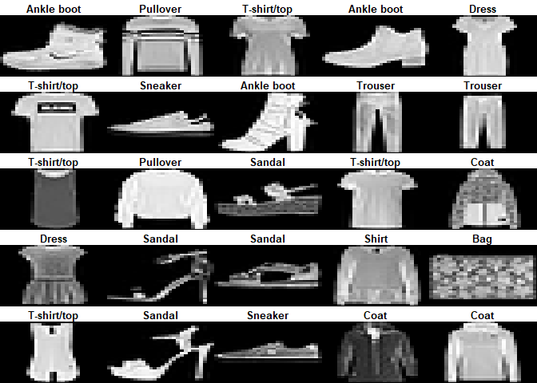
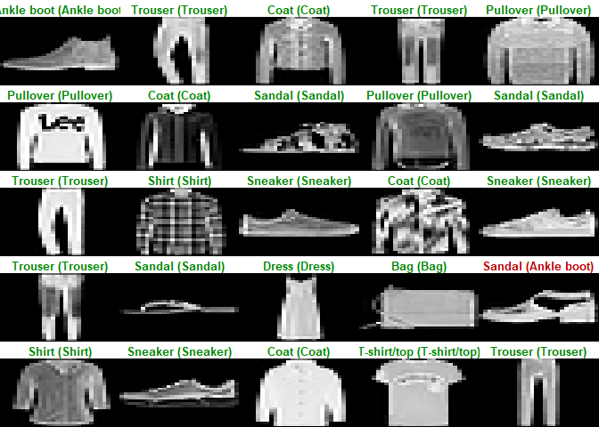

Homework - 7
================
Sriram Kannan

1.  Work through the “Image Classification” tutorial on the RStudio
    Keras website.

``` r
library(keras)
```

    ## Warning: package 'keras' was built under R version 4.1.3

``` r
fashion_mnist <- dataset_fashion_mnist()
```

    ## Loaded Tensorflow version 2.8.0

``` r
c(train_images, train_labels) %<-% fashion_mnist$train
c(test_images, test_labels) %<-% fashion_mnist$test

class_names = c('T-shirt/top',
                'Trouser',
                'Pullover',
                'Dress',
                'Coat', 
                'Sandal',
                'Shirt',
                'Sneaker',
                'Bag',
                'Ankle boot')

dim(train_images)
```

    ## [1] 60000    28    28

``` r
dim(train_labels)
```

    ## [1] 60000

``` r
train_labels[1:20]
```

    ##  [1] 9 0 0 3 0 2 7 2 5 5 0 9 5 5 7 9 1 0 6 4

``` r
dim(test_images)
```

    ## [1] 10000    28    28

``` r
dim(test_labels)
```

    ## [1] 10000

``` r
library(tidyr)
library(ggplot2)

image_1 <- as.data.frame(train_images[1, , ])
colnames(image_1) <- seq_len(ncol(image_1))
image_1$y <- seq_len(nrow(image_1))
image_1 <- gather(image_1, "x", "value", -y)
image_1$x <- as.integer(image_1$x)

ggplot(image_1, aes(x = x, y = y, fill = value)) +
  geom_tile() +
  scale_fill_gradient(low = "white", high = "black", na.value = NA) +
  scale_y_reverse() +
  theme_minimal() +
  theme(panel.grid = element_blank())   +
  theme(aspect.ratio = 1) +
  xlab("") +
  ylab("")
```

<!-- -->

``` r
train_images <- train_images / 255
test_images <- test_images / 255
```

``` r
par(mfcol=c(5,5))
par(mar=c(0, 0, 1.5, 0), xaxs='i', yaxs='i')
for (i in 1:25) { 
  img <- train_images[i, , ]
  img <- t(apply(img, 2, rev)) 
  image(1:28, 1:28, img, col = gray((0:255)/255), xaxt = 'n', yaxt = 'n',
        main = paste(class_names[train_labels[i] + 1]))
}
```

<!-- -->

``` r
model <- keras_model_sequential()
model %>%
  layer_flatten(input_shape = c(28, 28)) %>%
  layer_dense(units = 128, activation = 'relu') %>%
  layer_dense(units = 10, activation = 'softmax')

model %>% compile(
  optimizer = 'adam', 
  loss = 'sparse_categorical_crossentropy',
  metrics = c('accuracy')
)
model %>% fit(train_images, train_labels, epochs = 5, verbose = 2)
```

``` r
score <- model %>% evaluate(test_images, test_labels, verbose = 0)
score
```

    ##      loss  accuracy 
    ## 0.3508546 0.8731000

``` r
predictions <- model %>% predict(test_images)
predictions[1, ]
```

    ##  [1] 4.007385e-05 7.571050e-08 2.899660e-07 7.184571e-10 1.039051e-06
    ##  [6] 8.080194e-03 2.040194e-06 1.406180e-02 8.758253e-07 9.778136e-01

``` r
which.max(predictions[1, ])
```

    ## [1] 10

``` r
test_labels[1]
```

    ## [1] 9

``` r
par(mfcol=c(5,5))
par(mar=c(0, 0, 1.5, 0), xaxs='i', yaxs='i')
for (i in 1:25) { 
  img <- test_images[i, , ]
  img <- t(apply(img, 2, rev)) 
  # subtract 1 as labels go from 0 to 9
  predicted_label <- which.max(predictions[i, ]) - 1
  true_label <- test_labels[i]
  if (predicted_label == true_label) {
    color <- '#008800' 
  } else {
    color <- '#bb0000'
  }
  image(1:28, 1:28, img, col = gray((0:255)/255), xaxt = 'n', yaxt = 'n',
        main = paste0(class_names[predicted_label + 1], " (",
                      class_names[true_label + 1], ")"),
        col.main = color)
}
```

<!-- -->

2.  Use the Keras library to re-implement the simple neural network
    discussed during lecture for the mixture data (see nnet.R). Use a
    single 10-node hidden layer; fully connected.

``` r
library('rgl')
```

    ## Warning: package 'rgl' was built under R version 4.1.3

``` r
library('ElemStatLearn')
library('nnet')
library('dplyr')
```

    ## 
    ## Attaching package: 'dplyr'

    ## The following objects are masked from 'package:stats':
    ## 
    ##     filter, lag

    ## The following objects are masked from 'package:base':
    ## 
    ##     intersect, setdiff, setequal, union

``` r
data("mixture.example")
dat <- mixture.example


#Single 10-node hidden layer; fully connected.

keras_fit <- keras_model_sequential()
keras_fit %>% 
  #hidden layer
  layer_dense(units = 10, activation = 'relu') %>%
  #output layer
  layer_dense(units = 2, activation = 'softmax') 
  
keras_fit %>% compile(optimizer = 'adam', 
                 loss = 'sparse_categorical_crossentropy', 
                 metrics = c('accuracy') 
                 )

keras_fit %>% fit(x=dat$x, y=dat$y, epochs = 5, verbose = 2) 
```

3)Create a figure to illustrate that the predictions are (or are not)
similar using the ‘nnet’ function versus the Keras model.

``` r
# plot data
plot_mixture_data <- expression({
  plot(dat$x[,1], dat$x[,2],
       col=ifelse(dat$y==0, 'blue', 'orange'),
       pch=20,
       xlab=expression(x[1]),
       ylab=expression(x[2]))
  ## draw Bayes (True) classification boundary
  prob <- matrix(dat$prob, length(dat$px1), length(dat$px2))
  cont <- contourLines(dat$px1, dat$px2, prob, levels=0.5)
  rslt <- sapply(cont, lines, col='purple')
})
```

``` r
keras_probs <- keras_fit %>% predict(dat$xnew)
#keras_preds <- keras_fit %>% predict_classes(dat$xnew)
plot_keras_preds <- function(fit, dat=mixture.example) {
  
  eval(plot_mixture_data)
  probs <- keras_probs[,1]
  #preds <- keras_preds
  probm <- matrix(probs, length(dat$px1), length(dat$px2))
  cls <- contourLines(dat$px1, dat$px2, probm, levels=0.5)
  rslt <- sapply(cls, lines, col='black')
}
plot_keras_preds(keras_fit) 
```

<!-- -->

``` r
# NNet
nnet_fit <- nnet(x=dat$x, y=dat$y, size=10, entropy=TRUE, decay=0) 
```

    ## # weights:  41
    ## initial  value 168.073414 
    ## iter  10 value 98.954101
    ## iter  20 value 90.008698
    ## iter  30 value 82.502481
    ## iter  40 value 77.083434
    ## iter  50 value 72.272650
    ## iter  60 value 66.766777
    ## iter  70 value 64.894564
    ## iter  80 value 62.859540
    ## iter  90 value 61.143798
    ## iter 100 value 58.892066
    ## final  value 58.892066 
    ## stopped after 100 iterations

``` r
nnet_preds <- predict(nnet_fit, dat$xnew, type="class")
nnet_probs <- predict(nnet_fit, dat$xnew, type="raw")
plot_nnet_preds <- function(fit, dat=mixture.example) {
  
  eval(plot_mixture_data)
  preds <- nnet_preds
  probs <- nnet_probs[,1]
  probm <- matrix(probs, length(dat$px1), length(dat$px2))
  cls <- contourLines(dat$px1, dat$px2, probm, levels=0.5)
  rslt <- sapply(cls, lines, col='black')
}
plot_nnet_preds(nnet_fit) 
```

<!-- -->

4.  (optional extra credit) Convert the neural network described in the
    “Image Classification” tutorial to a network that is similar to one
    of the convolutional networks described during lecture on 4/15
    (i.e., Net-3, Net-4, or Net-5) and also described in the ESL book
    section 11.7. See the !ConvNet tutorial on the RStudio Keras
    website.

``` r
model2 <- keras_model_sequential() %>% 
  layer_conv_2d(filters = 32, kernel_size = c(3,3), activation = "relu", 
                input_shape = c(28,28,1)) %>% 
  layer_max_pooling_2d(pool_size = c(2,2)) %>% 
  layer_conv_2d(filters = 64, kernel_size = c(3,3), activation = "relu") %>% 
  layer_max_pooling_2d(pool_size = c(2,2)) %>% 
  layer_conv_2d(filters = 64, kernel_size = c(3,3), activation = "relu")
summary(model2)
```

    ## Model: "sequential_2"
    ## ________________________________________________________________________________
    ##  Layer (type)                       Output Shape                    Param #     
    ## ================================================================================
    ##  conv2d_2 (Conv2D)                  (None, 26, 26, 32)              320         
    ##                                                                                 
    ##  max_pooling2d_1 (MaxPooling2D)     (None, 13, 13, 32)              0           
    ##                                                                                 
    ##  conv2d_1 (Conv2D)                  (None, 11, 11, 64)              18496       
    ##                                                                                 
    ##  max_pooling2d (MaxPooling2D)       (None, 5, 5, 64)                0           
    ##                                                                                 
    ##  conv2d (Conv2D)                    (None, 3, 3, 64)                36928       
    ##                                                                                 
    ## ================================================================================
    ## Total params: 55,744
    ## Trainable params: 55,744
    ## Non-trainable params: 0
    ## ________________________________________________________________________________

``` r
model2 %>% 
  layer_flatten() %>% 
  layer_dense(units = 64, activation = "relu") %>% 
  layer_dense(units = 10, activation = "softmax")
model2 %>% compile(
  optimizer = 'adam', 
  loss = 'sparse_categorical_crossentropy',
  metrics = c('accuracy')
)
```

``` r
model2 %>% fit(train_images, train_labels, epochs = 5, verbose = 2)
```

``` r
score <- model2 %>% evaluate(test_images, test_labels, verbose = 0)
score
```

    ##      loss  accuracy 
    ## 0.2578286 0.9086000

``` r
predictions <- model2 %>% predict(test_images)
predictions[1, ]
```

    ##  [1] 4.893352e-07 2.694193e-07 8.239990e-08 1.842365e-07 1.970815e-07
    ##  [6] 2.618303e-04 6.381633e-08 3.777729e-03 1.976851e-06 9.959571e-01

``` r
which.max(predictions[1, ])
```

    ## [1] 10

``` r
test_labels[1]
```

    ## [1] 9

``` r
par(mfcol=c(5,5))
par(mar=c(0, 0, 1.5, 0), xaxs='i', yaxs='i')
for (i in 1:25) { 
  img <- test_images[i, , ]
  img <- t(apply(img, 2, rev)) 
  # subtract 1 as labels go from 0 to 9
  predicted_label <- which.max(predictions[i, ]) - 1
  true_label <- test_labels[i]
  if (predicted_label == true_label) {
    color <- '#008800' 
  } else {
    color <- '#bb0000'
  }
  image(1:28, 1:28, img, col = gray((0:255)/255), xaxt = 'n', yaxt = 'n',
        main = paste0(class_names[predicted_label + 1], " (",
                      class_names[true_label + 1], ")"),
        col.main = color)
}
```

<!-- -->
